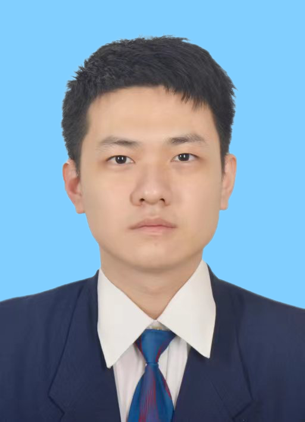
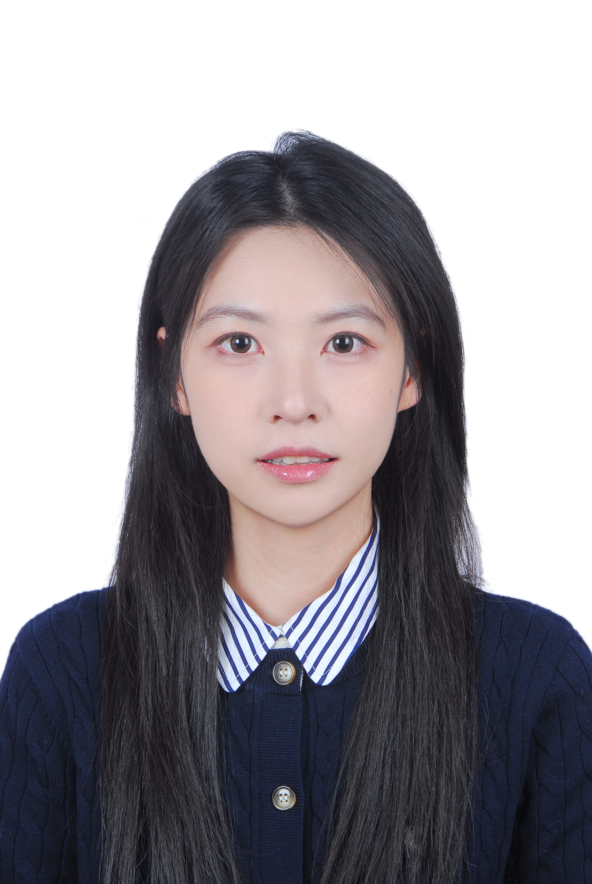
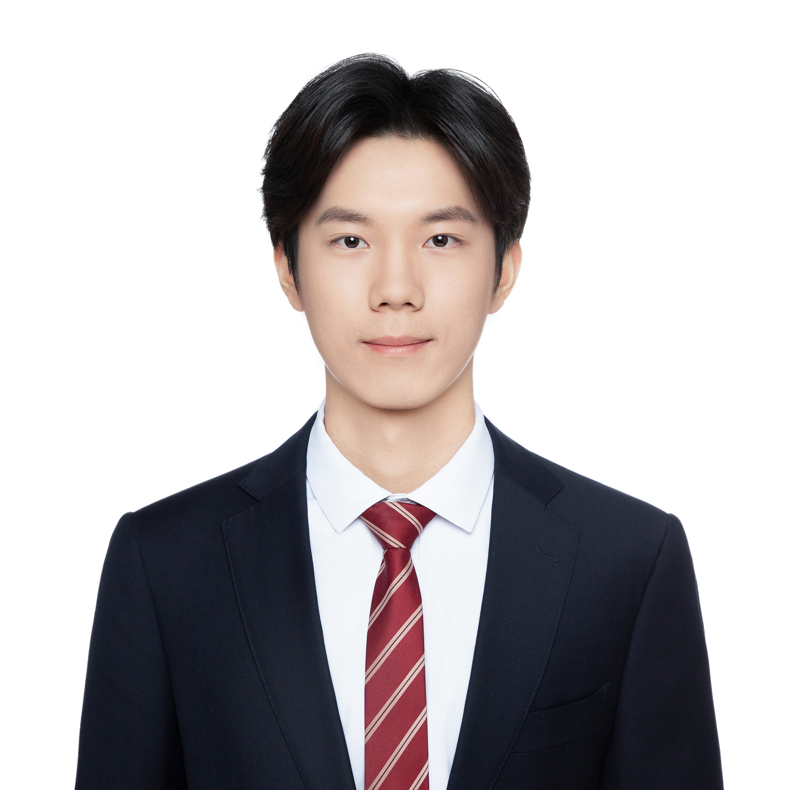

Here are the students I supervise or co-supervise and work with in various research projects since 2024/09.

    🏆 The PhD students I co-supervise (Ze Chai, Zhiqiang Xie, Xinlei Yu) won the third prize in the "Jinnang-2024" Future Warfare Scenarios and Creative Ideas Competition organized by China Aerospace Science and Industry Corporation (航天科工“锦囊-2024”未来战争场景与创意征集比赛), 2025/03
    🏆 The undergraduate student I co-supervise (Jingbo Fan) received the Beijing Natural Science Foundation's Undergraduate "Qiyan Program" funding (北京市自然科学基金本科生“启研计划”资助）, 2024/09
  

- **Xinlei Yu**

  
  

    
<strong>Role:</strong> Co-supervised PhD candidate 

    
<strong>Research Interests:</strong> Federated Learning, Distributed Machine Learning, Gradient Compression 

    
<strong>Email:</strong> yuxinlei518@bupt.edu.cn

  

   <!--   
   **Role:** Co-supervised PhD candidate  
   **Research Interests:** Federated Learning, Distributed Machine Learning, Gradient Compression   
   **Email:** yuxinlei518@bupt.edu.cn  -->

- **Ze Chai**

  
  

    
<strong>Role:</strong> Co-supervised PhD student 

    
<strong>Research Interests:</strong> Machine Learning, Data Security, Blockchain  

    
<strong>Email:</strong> chaize@bupt.edu.cn

  

- **Zhiqiang Xie**

  
  

    
<strong>Role:</strong> Co-supervised PhD student 

    
<strong>Research Interests:</strong> Data Unlearning for Federated Learning and LLMs 

    
<strong>Email:</strong> xiezhiqiang@bupt.edu.cn

  

- **Jiayi Wang**

  
  

    
<strong>Role:</strong> Co-supervised Graduate student 

    
<strong>Research Interests:</strong> Data Unlearning for Federated Learning and LLMs 

    
<strong>Email:</strong> wangjiayi2019@bupt.edu.cn

  

- **Jingbo Fan**

  
  

    
<strong>Role:</strong> Co-supervised Undergraduate student 

    
<strong>Research Interests:</strong> Data Unlearning for Federated Learning and LLMs 

    
<strong>Email:</strong> fanjingbo@bupt.edu.cn

  

  
